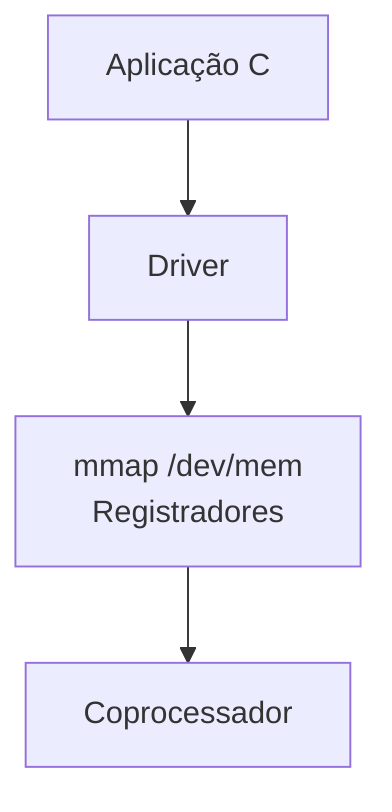
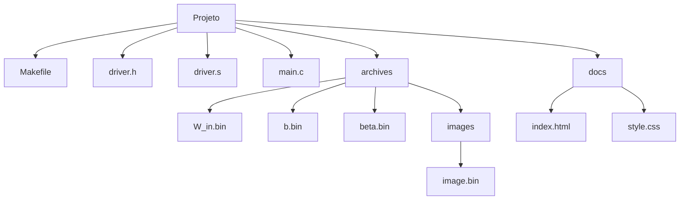

# DE1-SoC ELM Driver   
# Sumário

- [1. Visão Geral](#1-visão-geral)
- [2. Levantamento de Requisitos](#2-levantamento-de-requisitos)
- [3. Arquitetura do Sistema](#3-arquitetura-do-sistema)
- [4. Tecnologias e Softwares Utilizados](#4-tecnologias-e-softwares-utilizados)
- [5. Estrutura do Projeto](#5-estrutura-do-projeto)
- [6. Instalação e Configuração](#6-instalação-e-configuração)
- [7. Execução](#7-execução)
- [8. API Pública](#8-api-pública)
- [9. Protocolo de Comunicação](#9-protocolo-de-comunicação)
- [10. Testes](#10-testes)

---

# 1. Visão Geral

[Site de documentação](https://marcosvdiaso.github.io/de1soc-driver-elm/)

O projeto implementa um driver de comunicação entre um processador ARM HPS e um coprocessador ELM embarcado em FPGA na plataforma DE1-SoC.

Toda a lógica do driver foi implementada em ARM Assembly, incluindo:

- Mapeamento de memória física via mmap
- Controle de registradores da FPGA
- Protocolo de handshake
- Envio de instruções
- Inicialização da inferência
- Leitura de resultados

O objetivo do projeto é fornecer uma interface de software para controle do acelerador ELM diretamente do Linux embarcado da DE1-SoC.
O coprocessador ELM utilizado neste projeto foi fornecido pelo docente da disciplina. Mais detalhes sobre ele podem ser vistos [aqui](https://github.com/DestinyWolf/Problema_SD_2026_1/tree/master).


---

# 2. Levantamento de Requisitos

## Requisitos Funcionais

O sistema deve:

- Mapear os registradores físicos da FPGA
- Realizar comunicação entre HPS e FPGA
- Implementar protocolo de handshake
- Enviar imagens e pesos do modelo ELM
- Inicializar inferência
- Ler resultados produzidos pelo coprocessador
- Medir métricas de desempenho

## Requisitos Não Funcionais

O sistema deve:

- Operar em tempo reduzido
- Garantir sincronização correta entre ARM e FPGA
- Operar diretamente sobre Linux embarcado

## Requisitos de Hardware

- FPGA Terasic DE1-SoC
- Processador ARM Cortex-A9
- Linux embarcado na DE1-SoC
- Coprocessador ELM gravado na FPGA


---

# 3. Arquitetura do Sistema

A arquitetura do projeto é dividida em quatro camadas principais:

1. Aplicação em C (Marco 3)
2. Driver em ARM Assembly (Marco 2)
3. Interface HPS-FPGA via memória mapeada (Marco 2)
4. Coprocessador ELM implementado em FPGA (Marco 1)

O fluxo de comunicação ocorre da seguinte forma:



## Descrição das Camadas

### Aplicação C

A princípio está servindo apenas para:

- Inicialização do driver
- Solicitação de inferência
- Coleta de métricas
- Exibição de resultados

Porém após finalização do marco 3 é esperado que:
- Possa receber path dos arquivos
- Enviar arquivos ao driver
- Salvar um log em csv

---

### Driver ARM Assembly

Camada responsável pela comunicação direta com o hardware.

Implementa:

- Controle dos registradores
- Protocolo de handshake
- Envio de instruções
- Polling de status
- Controle de temporização

Toda a implementação do driver foi realizada em ARM Assembly.

---

### Memória Mapeada (`mmap`)

O driver utiliza `/dev/mem` e `mmap` para mapear a região física dos registradores da FPGA no espaço de endereçamento virtual do processo.

Base física utilizada:

```text
0xFF200000
```

Span mapeado:

```text
0x1000
```

A comunicação entre o HPS e o coprocessador ocorre exclusivamente através desses registradores mapeados em memória.

---

### CoProcessador

O CoProcessador utilizado pode ser encontrado [aqui](https://github.com/DestinyWolf/Problema_SD_2026_1/tree/master).
Foram feitas apenas algumas adaptações apra uso do CoProcessador:

- Ele foi fundido junto a um HPS fornecido pelo professor, sendo instanciado no main file da HPS
- Foram criados 3 PIOs novos no projeto, para data_in, data_out e os signals


---

# 4. Tecnologias e Softwares Utilizados

## Sistema Operacional

| Software | Finalidade |
|---|---|
| Ubuntu 24.04 | Ambiente principal de desenvolvimento |

---

## Desenvolvimento

| Ferramenta | Finalidade |
|---|---|
| Neovim 0.12.2 | Desenvolvimento local |
| Visual Studio Code 1.120.0 | Desenvolvimento em laboratório |

---

## Compilação

| Ferramenta | Finalidade |
|---|---|
| gcc-arm-linux-gnueabihf | Cross-compilação para ARM Cortex-A9 |
| GNU Assembler (GAS) | Montagem do código ARM Assembly |

---

## FPGA

| Ferramenta | Finalidade |
|---|---|
| Quartus Prime Lite | Gravação da FPGA |

---

## Linguagens Utilizadas

- ARM Assembly
- C99


---

# 5. Estrutura do Projeto

    



---

# 6. Instalação e Configuração

## Dependências

É necessário o toolchain de cross-compilação para ARM Linux:

```bash
sudo apt install gcc-arm-linux-gnueabihf
```

---

## Build

Clone o repositório e compile utilizando `make`:

```bash
git clone https://github.com/marcosvdiaso/de1soc-driver-elm.git
cd "de1soc-driver-elm/Marco 2 - Driver"
make
```

O `Makefile` executa:

```bash
arm-linux-gnueabihf-gcc -g -std=c99 -marm -o driver main.c driver.s -lm -lrt
```

Para remover o binário gerado:

```bash
make clean
```

---

## Configuração da FPGA

O coprocessador ELM deve estar previamente sintetizado e gravado na FPGA da DE1-SoC utilizando Quartus Prime.

Após a configuração da FPGA é necessário:

- Inicializar o Linux embarcado da DE1-SoC
- Garantir permissões de acesso ao `/dev/mem`
- Executar o programa como `root`

---

## Arquivos Binários Necessários

Os pesos do modelo e a imagem de entrada são embutidos no binário em tempo de compilação utilizando `.incbin`.
É IMPRESCINDÍVEL a existência desses arquivos antes do build:

| Arquivo | Conteúdo | Itens |
|---|---|---|
| `archives/W_in.bin` | Matriz de pesos de entrada | 100.352 valores Q4.12 |
| `archives/b.bin` | Bias da camada oculta | 128 valores Q4.12 |
| `archives/beta.bin` | Pesos de saída | 1.280 valores Q4.12 |
| `archives/images/image.bin` | Imagem de entrada | 784 bytes |


---

# 7. Execução

Na DE1-SoC:

```bash
sudo ./driver
```


O programa solicita:

- Dígito esperado
- Quantidade de inferências

Ao final são exibidas métricas de desempenho.


---

# 8. API Pública

## `int elm_open(void)`

Abre `/dev/mem` e realiza `mmap` da região da FPGA.

Retorno:

- `0` → sucesso
- `-1` → erro

---

## `void elm_close(void)`

Desfaz `munmap` e fecha o file descriptor.

---

## `void elm_reset(void)`

Gera pulso de reset no coprocessador.

---

## `int elm_load(void)`

Envia imagem, bias, beta e pesos para FPGA.

Retorno:

- `0` → sucesso
- `-1` → erro

---

## `int elm_start(void)`

Inicia inferência e aguarda finalização.

Retorno:

- valor de `DATA_OUT`
- `-1` em caso de erro

---

## `int elm_result(void)`

Extrai o dígito predito.


---

# 9. Protocolo de Comunicação

## Registradores

| Registrador | Offset | Função |
|---|---|---|
| DATA_IN | `0x00` | Envio de instruções |
| SIGNALS | `0x10` | Controle de handshake |
| DATA_OUT | `0x20` | Resultado e status |

---

## Bits de Controle

### SIGNALS

| Bit | Função |
|---|---|
| 0 | Enable |
| 1 | Clear |
| 2 | Reset |

### DATA_OUT

| Bit | Significado |
|---|---|
| 4 | DONE |
| 5 | BUSY |
| 6 | ERROR |
| [3:0] | Resultado |

---

# 10. Testes

## Benchmark Progressivo

Foram feitos testes sequenciais para 100 testes, 10000 testes, 100000 e 1000000 de testes:
<details>


</details>

| Iterações | Resultado | Robustez | Latência | Throughput | Jitter |
|---|---|---|---|---|---|
| 100 | OK | 100% | 171691 ns | 5824.40 iferências/s | 1665304 ns |
| 10000 | OK | 100% | 6268 ns | 159521.13 iferências/s | 167425 ns |
| 100000 | OK | 100% | 4215 ns | 237197.97 iferências/s | 52938 ns |
| 1000000 | Overflow nas métricas | 100% | -249 ns | -4003484.54 inferências/s | 17283 ns |

## Digito predito diferente do digito esperado


Caso o digito predito seja diferente do digito esperado, teremos uma robustez de 0% nas métricas finais.

---

# Autor

Marcos Vinícius Dias Oliveira

Matheus ...

Projeto desenvolvido para a disciplina TEC499
