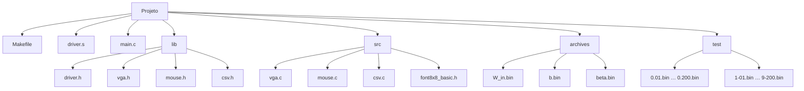

# DE1-SoC ELM Driver   

# Sumário

- [1. Visão Geral](#1-visão-geral)
- [2. Levantamento de Requisitos](#2-levantamento-de-requisitos)
- [3. Arquitetura do Sistema](#3-arquitetura-do-sistema)
- [4. Tecnologias e Softwares Utilizados](#4-tecnologias-e-softwares-utilizados)
- [5. Estrutura do Projeto](#5-estrutura-do-projeto)
- [6. Instalação e Configuração](#6-instalação-e-configuração)
- [7. Execução](#7-execução)
- [8. Assembly](#8-assembly)
- [9. Módulos da Aplicação C](#9-módulos-da-aplicação-c)
- [10. API Pública](#10-api-pública)
- [11. Protocolo de Comunicação](#11-protocolo-de-comunicação)
- [12. Testes](#12-testes)
- [13. Conclusão](#13-conclusão)

---

# 1. Visão Geral

Este marco completa o sistema de classificação de dígitos numéricos na plataforma DE1-SoC, integrando a aplicação em C com o IP-Core VGA, entrada via mouse e um modo de validação/benchmark sobre dataset completo.

O sistema final é composto por quatro camadas:

- **Coprocessador ELM em FPGA** (Marco 1): núcleo de inferência em Verilog
- **Driver em ARM Assembly** (Marco 2): API de comunicação com a FPGA via MMIO
- **Módulos de interface** (Marco 3): VGA, mouse e CSV, implementados em C
- **Aplicação principal** (Marco 3): CLI interativa com três modos de operação

A aplicação permite ao usuário classificar dígitos MNIST a partir de um arquivo binário, desenhá-los diretamente na tela usando o mouse, ou executar um benchmark automático sobre um dataset com 2.000 imagens, gerando métricas detalhadas e salvando os resultados em CSV.

---

# 2. Levantamento de Requisitos

## Requisitos Funcionais

O sistema deve:

- Exibir um menu interativo com os três modos de operação
- Receber o caminho da imagem via argumento de linha de comando ou entrada do usuário
- Ler imagens de 28×28 pixels (784 bytes) no formato `.bin`
- Exibir a imagem na tela VGA antes de realizar a inferência
- Permitir ao usuário desenhar um dígito com o mouse na tela VGA e classificá-lo
- Enviar a imagem ao coprocessador via driver e obter o dígito predito
- Executar benchmark automático sobre a pasta `test/` com 2.000 imagens
- Computar e exibir as métricas: acurácia, latência média, throughput e desvio padrão
- Salvar log detalhado do benchmark em arquivo CSV

## Requisitos Não Funcionais

O sistema deve:

- Integrar ao driver ARM Assembly do Marco 2 sem modificação da lógica de comunicação com a FPGA
- Operar sobre Linux embarcado da DE1-SoC em modo texto
- Utilizar o IP-Core VGA disponibilizado pelo professor via barramento MMIO
- Gerar o arquivo CSV com timestamp no nome para evitar sobrescrita

## Requisitos de Hardware

- FPGA Terasic DE1-SoC com coprocessador ELM gravado
- Processador ARM Cortex-A9
- Linux embarcado na DE1-SoC
- Monitor conectado à saída VGA da DE1-SoC
- Mouse USB conectado à DE1-SoC

---

# 3. Arquitetura do Sistema

A arquitetura é organizada em cinco camadas:

1. Aplicação C -> `main.c`
2. Módulos de interface -> `vga.c`, `mouse.c`, `csv.c`
3. Driver em ARM Assembly -> `driver.s`
4. Interface HPS-FPGA via memória mapeada
5. Coprocessador ELM em FPGA

```mermaid
flowchart TD

    A[Aplicação C\nmain.c]
    B[VGA\nvga.c]
    C[Mouse\nmouse.c]
    D[CSV\ncsv.c]
    E[Driver Assembly\ndriver.s]
    F["mmap /dev/mem\nRegistradores"]
    G[Coprocessador ELM]
    H[/dev/input/event0]

    A --> B
    A --> C
    A --> D
    A --> E
    B --> F
    E --> F
    F --> G
    H --> C
```

## Descrição das Camadas

### Aplicação C -> `main.c`

Ponto de entrada do sistema. Implementa o menu interativo com os três modos:

- **Modo 1: Inferência por arquivo:** lê a imagem de um caminho fornecido via CLI ou entrada do usuário, exibe na VGA e infere com o coprocessador
- **Modo 2: Inferência por desenho:** inicializa a grade na VGA e aguarda o usuário desenhar o dígito com o mouse; ao confirmar, envia para inferência
- **Modo 3> Benchmark:** varre automaticamente toda a pasta `test/` (2.000 imagens), infere cada uma, computa métricas e salva CSV

A inicialização do driver (`elm_open`, `elm_reset`, `elm_load`) e da VGA (`vga_start`, `vga_reset`) é feita uma única vez antes do menu.

---

### Módulo VGA -> `vga.c`

Controla a exibição na tela VGA de 320×240 pixels via registrador mapeado no offset `0x0030` da região base da FPGA.

O mapeamento de memória é compartilhado com o driver: o ponteiro `mmap` é obtido chamando `elm_mmap()`, evitando um segundo `mmap` independente.

Cada pixel da imagem 28×28 é escalado para um bloco de 7×7 pixels na tela, centralizando a imagem na região `(62,22)–(258,218)`. A borda ao redor da imagem é preenchida com uma cor de destaque para delimitar a área de desenho.

---

### Módulo Mouse -> `mouse.c`

Lê eventos do dispositivo `/dev/input/event0` usando a estrutura `input_event` do kernel Linux.

O cursor é desenhado como um bloco vermelho de 7×7 pixels na tela VGA. O movimento é acumulado a cada evento `EV_REL` e aplicado apenas na sincronização (`EV_SYN`), garantindo atualizações consistentes.

Modos de operação via botões:

- **Botão esquerdo pressionado:** pinta o pixel sob o cursor como branco (255) e suaviza os vizinhos adjacentes (valor 120), simulando traço com borda
- **Botão direito pressionado:** apaga o pixel sob o cursor (valor 0)
- **Botão do meio (scroll):** confirma o desenho e encerra a captura

O cursor é restrito à área da imagem (`x ∈ [62, 251]`, `y ∈ [22, 211]`). Ao mover, a posição anterior é restaurada a partir do vetor `img[]`, apagando o rastro do cursor sem destruir o conteúdo desenhado.

---

### Módulo CSV -> `csv.c`

Cria e escreve o arquivo de log do benchmark. O nome do arquivo é gerado automaticamente com base na data e hora do sistema no formato `benchmark_AAAAMMDD_HHMMSS.csv`.

O CSV contém duas seções:

- **Por inferência:** número da inferência, nome do arquivo, dígito predito, dígito esperado, resultado (Correta/Incorreta), latência em nanosegundos
- **Resumo final:** total de imagens, acertos, erros, falhas de leitura, falhas de inferência, acurácia, latência média, throughput e desvio padrão

---

### Driver ARM Assembly -> `driver.s`

Mantém toda a lógica de comunicação com o coprocessador do Marco 2. A principal mudança neste marco é que `elm_start` passou a receber um ponteiro `uint8_t *img` como argumento em `r0`, substituindo o uso de imagem embutida via `.incbin`.

Foi adicionada também a função `elm_mmap`, que retorna o ponteiro `r9` com o endereço virtual base da FPGA, permitindo que os módulos C (VGA) acessem outros registradores da mesma região mapeada sem necessidade de um segundo `mmap`.

---

# 4. Tecnologias e Softwares Utilizados

## Sistema Operacional

| Software     | Finalidade                            |
| ------------ | ------------------------------------- |
| Ubuntu 24.04 | Ambiente principal de desenvolvimento |

---

## Desenvolvimento

| Ferramenta                 | Finalidade                     |
| -------------------------- | ------------------------------ |
| Neovim 0.12.2              | Desenvolvimento local          |
| Visual Studio Code 1.120.0 | Desenvolvimento em laboratório |

---

## Compilação

| Ferramenta              | Finalidade                                          |
| ----------------------- | --------------------------------------------------- |
| gcc-arm-linux-gnueabihf | Cross-compilação para ARM Cortex-A9                 |
| GNU Assembler (GAS)     | Montagem do código ARM Assembly (`driver.s`)        |
| GNU Make                | Automação do build multi-módulo                     |

---

## FPGA

| Ferramenta         | Finalidade       |
| ------------------ | ---------------- |
| Quartus Prime Lite | Gravação da FPGA |

---

## Linguagens Utilizadas

- C99
- ARM Assembly (GAS)

---

# 5. Estrutura do Projeto



O diretório `test/` contém 2.000 imagens de teste, 200 por dígito, para os dígitos 0 a 9. O nome de cada arquivo codifica o dígito esperado no primeiro caractere (ex.: `7-106.bin` representa o dígito 7).

---

# 6. Instalação e Configuração

## Dependências

Toolchain de cross-compilação para ARM Linux:

```bash
sudo apt install gcc-arm-linux-gnueabihf
```

---

## Build

Clone o repositório e compile:

```bash
git clone https://github.com/marcosvdiaso/de1soc-elm-app.git
cd "de1soc-elm-app/Marco 3 - Aplicação"
make
```

O `Makefile` executa:

```bash
arm-linux-gnueabihf-gcc -g -std=c99 -marm -Ilib \
    -o driver main.c src/vga.c src/mouse.c src/csv.c driver.s \
    -lm -lrt
```

Para remover o binário:

```bash
make clean
```

---

## Configuração da FPGA

O coprocessador ELM deve estar previamente sintetizado e gravado via Quartus Prime. Após isso:

- Inicializar o Linux embarcado da DE1-SoC
- Garantir permissões de acesso a `/dev/mem` e `/dev/input/event0`
- Executar o programa como `root`
- Conectar monitor VGA e mouse USB antes de iniciar

---

## Arquivos Binários Necessários

Os pesos do modelo são embutidos no binário em tempo de compilação via `.incbin`:

| Arquivo             | Conteúdo                   | Itens                 |
| ------------------- | -------------------------- | --------------------- |
| `archives/W_in.bin` | Matriz de pesos de entrada | 100.352 valores Q4.12 |
| `archives/b.bin`    | Bias da camada oculta      | 128 valores Q4.12     |
| `archives/beta.bin` | Pesos de saída             | 1.280 valores Q4.12   |

As imagens de teste devem estar presentes na pasta `test/` para que o modo benchmark funcione.

---

# 7. Execução

Na DE1-SoC, executar com o caminho opcional da imagem:

```bash
# Modo geral (imagem pode ser passada pelo menu)
sudo ./driver

# Com caminho da imagem pré-definido para o Modo 1
sudo ./driver test/7-106.bin
```

Ao iniciar, o programa exibe o menu:

```
Digite o número correspondente menu:
1. Inferência enviando imagem
2. Inferência desenhando a imagem
3. Benchmark
4. Sair
```

---

## Modo 1: Inferência por Arquivo

O programa lê o caminho da imagem do argumento `argv[1]` ou solicita ao usuário caso não tenha sido passado. A imagem é carregada, exibida na VGA dentro da borda delimitada e enviada ao coprocessador. O resultado é impresso no terminal comparando o dígito predito com o esperado.

---

## Modo 2: Inferência por Desenho

A tela VGA é inicializada com a grade vazia. O usuário controla o cursor com o mouse:

- **Botão esquerdo:** pinta pixels (valor máximo com suavização dos vizinhos)
- **Botão direito:** apaga pixels
- **Botão do meio:** confirma o desenho e dispara a inferência

Após confirmar, o programa solicita o dígito esperado, envia a imagem ao coprocessador e exibe o resultado no terminal.

---

## Modo 3: Benchmark

O programa varre automaticamente todos os arquivos do diretório `test/`, extrai o dígito esperado do nome do arquivo, executa a inferência e acumula as métricas. Ao final exibe:

```
------------------------------------------
MÉTRICAS BENCHMARK
------------------------------------------
Total encontrado: 2000
Inferências válidas: 2000
Corretas: 768
Incorretas: 1232
Erros ao carregar imagem: 0
Erros ao iniciar inferência: 0
Acurácia: 38.40%
Latência média: 10112016 ns
Throughput: 98.89 inferências/s
Desvio padrão: 8374023 ns
```

Um arquivo CSV é gerado automaticamente com os resultados individuais de cada inferência e o resumo final.

---

# 8. Assembly

## Mudanças em relação ao Marco 2

### `elm_start` -> Recebe imagem por parâmetro

No Marco 2, a imagem era embutida no binário via `.incbin` e acessada diretamente. No Marco 3, `elm_start` recebe um ponteiro `uint8_t *img` em `r0`, permitindo que a aplicação C passe qualquer imagem em tempo de execução seja lida de arquivo ou desenhada pelo usuário.

Internamente, `elm_start` delega para `elm_store_img(img)` antes de disparar a instrução `START`.

### `elm_mmap` -> Expõe o ponteiro de mmap

Função nova adicionada para permitir que os módulos C (especificamente o VGA) acessem a região mapeada em memória sem abrir um segundo `mmap`. Retorna o valor atual de `r9`:

```asm
elm_mmap:
    mov r0, r9
    bx lr
```

O módulo VGA utiliza esse ponteiro para calcular o endereço do registrador VGA com o offset `0x0030`.

---

## Protocolo de Handshake -> `send_instruction`

Sem alterações. A instrução é escrita em `DATA_IN`, o enable é levantado, o driver aguarda `BUSY=1` por polling (confirmando captura), baixa o enable e aguarda `BUSY=0` antes de retornar.

---

## Montagem de Instruções -> `build_instruction`

Sem alterações. Recebe opcode em `r0`, endereço em `r1`, valor em `r2`, shift do endereço em `r3` e shift do valor em `r4`. Constrói a instrução de 32 bits via shift e OR e chama `send_instruction`.

---

# 9. Módulos da Aplicação C

## VGA: `src/vga.c`

### Mapeamento

O registrador VGA está no offset `0x0030` da base `0xFF200000`. O ponteiro é obtido via `elm_mmap()`:

```c
volatile uint8_t *base = (volatile uint8_t *)elm_mmap();
vga_ctrl = (volatile uint32_t *)(base + VGA_BASE);
```

### Formato do pixel

Cada escrita em `vga_ctrl` encoda a posição e a cor em um único valor de 32 bits:

| Bits    | Campo        |
| ------- | ------------ |
| [8:0]   | Coordenada X |
| [16:9]  | Coordenada Y |
| [20:18] | Canal R (3b) |
| [23:21] | Canal G (3b) |
| [26:24] | Canal B (3b) |
| [27]    | Enable write |

O handshake de escrita consiste em enviar o valor com bit 27 em 1 e em seguida enviar o mesmo valor com bit 27 em 0.

### Exibição da imagem

Cada pixel da imagem 28×28 é mapeado para um bloco de 7×7 pixels na tela, ocupando a região central `(62,22)–(258,218)`. O nível de cinza (8 bits) é reduzido para 3 bits (`px >> 5`) para caber nos canais RGB de 3 bits do IP-Core.

---

## Mouse: `src/mouse.c`

O dispositivo `/dev/input/event0` é aberto em modo leitura bloqueante. Eventos são processados usando a estrutura `input_event` do kernel:

```
EV_REL + REL_X / REL_Y  →  acumula movimento dx, dy
EV_KEY + BTN_LEFT        →  ativa modo desenho (1) ou neutro (0)
EV_KEY + BTN_RIGHT       →  ativa modo apagar (2) ou neutro (0)
EV_KEY + BTN_MIDDLE      →  encerra a captura
EV_SYN                   →  aplica movimento acumulado e atualiza a tela
```

O clamp garante que o cursor não sai da área da imagem. A função `vga_restore` redesenha as células VGA sobrescritas pelo cursor ao mover, usando o conteúdo atual do vetor `img[]`.

---

## CSV: `src/csv.c`

O arquivo é criado com `fopen` em modo escrita. O nome é gerado com `snprintf` a partir de `localtime`:

```c
snprintf(name, sizeof(name),
    "benchmark_%04d%02d%02d_%02d%02d%02d.csv",
    t->tm_year + 1900, t->tm_mon + 1, t->tm_mday,
    t->tm_hour, t->tm_min, t->tm_sec);
```

A função `infs_csv` é chamada dentro do loop do benchmark para registrar cada inferência. A função `smr_csv` é chamada ao final para escrever o bloco de métricas agregadas.

---

# 10. API Pública

## Driver: `lib/driver.h`

### `int elm_open(void)`

Abre `/dev/mem` e realiza `mmap` da região da FPGA. Salva o ponteiro internamente em `r9`.

Retorno: `0` em sucesso, `-1` em erro.

---

### `void elm_close(void)`

Desfaz `munmap` e fecha o file descriptor.

---

### `void elm_reset(void)`

Gera pulso de reset no coprocessador via bit 2 de `SIGNALS`.

---

### `int elm_load(void)`

Envia bias, beta e pesos para a FPGA na sequência: `elm_store_bias → elm_store_beta → elm_store_weights`.

Retorno: `0` em sucesso, `-1` em erro.

---

### `int elm_start(uint8_t *img)`

Recebe o ponteiro para o buffer de imagem (784 bytes), envia via `elm_store_img`, pulsa `clr_operation` e dispara a instrução `START`. Aguarda `DONE=1` em `DATA_OUT` por polling.

Retorno: valor de `DATA_OUT` em sucesso, `-1` em erro.

---

### `int elm_result(void)`

Lê `DATA_OUT` e extrai o dígito predito dos bits `[3:0]`.

Retorno: dígito predito `[0,9]`, `-1` em erro.

---

### `void *elm_mmap(void)`

Retorna o ponteiro para a região mapeada em memória. Usado pelos módulos C para acessar outros registradores da FPGA (ex.: VGA).

---

## VGA: `lib/vga.h`

### `int vga_start(void)`

Inicializa o ponteiro interno para o registrador VGA usando `elm_mmap()`.

### `int vga_reset(void)`

Preenche toda a tela 320×240 com preto.

### `void vga_draw(uint8_t *img)`

Exibe a imagem 28×28 na área central da tela, escalada para blocos de 7×7 pixels.

### `void vga_pixel(int x, int y, int r, int g, int b)`

Escreve um pixel na posição `(x, y)` com a cor `(r, g, b)` em 3 bits por canal.

### `void vga_border(void)`

Preenche a borda ao redor da área da imagem com uma cor de destaque.

### `void vga_draw_mouse(int x, int y)`

Desenha o cursor do mouse como um bloco vermelho de 7×7 pixels na posição `(x, y)`.

### `void vga_restore(uint8_t *img, int mx, int my)`

Restaura os pixels da área VGA coberta pelo cursor usando o conteúdo atual de `img[]`.

### `void vga_draw_cell(int px, int py, uint8_t cor)`

Redesenha o bloco 7×7 correspondente à célula `(px, py)` da grade 28×28 com a intensidade `cor`.

### `void vga_char(char c, int x, int y, int cl)` / `void vga_str(char *s, int x, int y, int cl)`

Renderizam um caractere ou string na VGA usando a fonte 8×8.

---

## Mouse: `lib/mouse.h`

### `void draw(uint8_t *img)`

Inicia a captura de eventos do mouse e habilita o desenho interativo na VGA. Bloqueia até que o botão do meio seja pressionado. O vetor `img[]` é atualizado em tempo real conforme o usuário desenha.

---

## CSV: `lib/csv.h`

### `FILE *create_csv(void)`

Cria o arquivo CSV com o timestamp no nome e escreve o cabeçalho por inferência.

Retorno: ponteiro `FILE *` em sucesso, `NULL` em erro.

### `void infs_csv(FILE *stream, char *name, int r, int e, double lat, int i)`

Registra o resultado de uma inferência individual no CSV.

### `void smr_csv(FILE *stream, int total, int ok, int wrng, int eimg, int einf, double lat, double thr, double jitter)`

Escreve o bloco de métricas agregadas ao final do arquivo.

---

# 11. Protocolo de Comunicação

## Registradores

| Registrador | Offset | Função                |
| ----------- | ------ | --------------------- |
| DATA_IN     | `0x00` | Envio de instruções   |
| SIGNALS     | `0x10` | Controle de handshake |
| DATA_OUT    | `0x20` | Resultado e status    |
| VGA_CTRL    | `0x30` | Controle do IP VGA    |

---

## Bits de Controle

### SIGNALS

| Bit | Função |
| --- | ------ |
| 0   | Enable |
| 1   | Clear  |
| 2   | Reset  |

### DATA_OUT

| Bit   | Significado |
| ----- | ----------- |
| [3:0] | Resultado   |
| 4     | DONE        |
| 5     | BUSY        |
| 6     | ERROR       |

---

# 12. Testes

## Benchmark com Dataset Completo

Foram realizadas três execuções do modo benchmark sobre o dataset completo de 2.000 imagens (200 por dígito, dígitos 0–9).

| Execução | Total | Corretas | Incorretas | Acurácia | Lat. Média (ns) | Throughput (inf/s) | Desvio Padrão (ns) |
| -------- | ----- | -------- | ---------- | -------- | --------------- | ------------------ | ------------------ |
| 1        | 2000  | 768      | 1232       | 38,40%   | 10.112.016      | 98,89              | 8.374.023          |
| 2        | 2000  | 768      | 1232       | 38,40%   | 10.005.697      | 99,94              | 8.376.301          |
| 3        | 2000  | 768      | 1232       | 38,40%   | 10.064.614      | 99,36              | 8.372.156          |

### Análise dos Resultados

**Estabilidade:** os três benchmarks produziram exatamente os mesmos 768 acertos e 1.232 erros, demonstrando que o sistema é completamente determinístico, a mesma imagem sempre produz o mesmo resultado, sem variação causada por ruído de hardware ou condição de corrida.

**Acurácia:** a taxa de 38,40% está abaixo do esperado para um modelo ELM no dataset MNIST. A causa principal é a quantização em ponto fixo Q4.12 (16 bits), que limita a representação dos pesos e introduz erro acumulado ao longo das 100.352 multiplicações de `W_in`. O modelo float original apresenta acurácia significativamente maior; a degradação é consequência direta da quantização e das limitações da representação de 4 bits para a parte inteira.

**Latência e Throughput:** a latência média de ~10ms por inferência reflete o tempo de transmissão dos 784 pixels pelo protocolo de handshake via MMIO, mais o tempo de processamento da FPGA. O throughput de ~99 inferências/segundo é consistente entre as execuções.

**Jitter:** o desvio padrão de ~8,3ms é elevado em relação à latência média (~10ms), o que indica grande variação entre inferências individuais. Isso é esperado em um sistema sem prioridade de tempo real, onde o processo pode ser interrompido pelo scheduler do Linux entre as medições.

**Dataset:** o benchmark varre a pasta `test/` com `readdir`, sem ordenação garantida pelo sistema de arquivos. A consistência dos resultados entre execuções confirma que a ordem de processamento não afeta a acurácia total.

**Erros de I/O:** todas as execuções apresentaram zero erros de leitura de imagem e zero erros de inferência, confirmando a estabilidade do protocolo de handshake entre HPS e FPGA.

---

## Modo de Desenho

O modo de desenho via mouse foi testado com dígitos traçados manualmente na grade VGA 28×28. O sistema respondeu corretamente ao pintar e apagar pixels com os botões esquerdo e direito, ao restringir o cursor à área delimitada e ao encerrar a captura ao pressionar o botão do meio. A inferência após o desenho retornou resultados coerentes com os traços realizados.

---

# 13. Conclusão

O Marco 3 completa o sistema de classificação de dígitos numéricos sobre o SoC DE1-SoC, entregando uma aplicação C interativa com três modos de operação plenamente funcionais.

A integração entre os módulos, driver Assembly, VGA, mouse e CSV, funcionou corretamente, com o compartilhamento do ponteiro `mmap` via `elm_mmap()` eliminando a necessidade de um segundo mapeamento de memória para o IP-Core VGA.

Os requisitos do Marco 3 foram atendidos:

- Inferência a partir de arquivo com exibição na VGA
- Desenho interativo via mouse com feedback visual em tempo real
- Benchmark automático sobre dataset de 2.000 imagens com log CSV

O gargalo identificado é a acurácia de 38,40%, causada pela quantização Q4.12 dos pesos. Uma melhoria possível seria aumentar a precisão para Q8.8 ou implementar re-escalonamento dinâmico dos pesos antes da quantização, preservando mais informação do modelo float original.

---

# Autores

Marcos Vinícius Dias Oliveira

Matheus Silva Rodrigues

Projeto desenvolvido para a disciplina TEC499 - Sistemas Digitais, UEFS 2026.1
