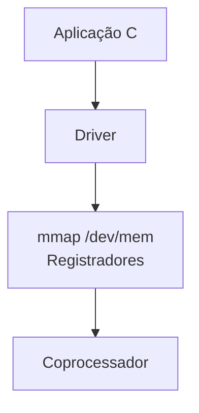
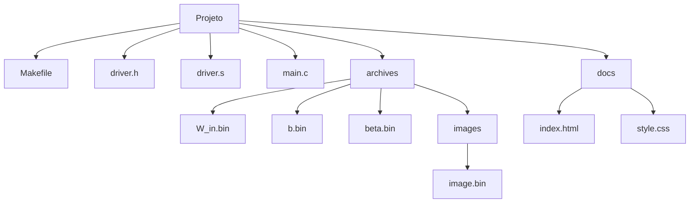

# DE1-SoC ELM Driver   

# Sumário

- [1. Visão Geral](#1-visão-geral)
- [2. Levantamento de Requisitos](#2-levantamento-de-requisitos)
- [3. Arquitetura do Sistema](#3-arquitetura-do-sistema)
- [4. Tecnologias e Softwares Utilizados](#4-tecnologias-e-softwares-utilizados)
- [5. Estrutura do Projeto](#5-estrutura-do-projeto)
- [6. Instalação e Configuração](#6-instalação-e-configuração)
- [7. Execução](#7-execução)
- [8. Assembly](#8-assembly)
- [9. API Pública](#9-api-pública)
- [10. Protocolo de Comunicação](#10-protocolo-de-comunicação)
- [11. Testes](#11-testes)
- [12. Conclusão](#12-conclusão)

---

# 1. Visão Geral

O projeto implementa um driver de comunicação entre um processador ARM HPS e um coprocessador ELM embarcado em FPGA na plataforma DE1-SoC.

Toda a lógica do driver foi implementada em ARM Assembly, incluindo:

- Mapeamento de memória física via mmap
- Controle de registradores da FPGA
- Protocolo de handshake
- Envio de instruções
- Inicialização da inferência
- Leitura de resultados

O objetivo do projeto é fornecer uma interface de software para controle do acelerador ELM diretamente do Linux embarcado da DE1-SoC.
O coprocessador ELM utilizado neste projeto foi fornecido pelo docente da disciplina. Mais detalhes sobre ele podem ser vistos [aqui](https://github.com/DestinyWolf/Problema_SD_2026_1/tree/master).

---

# 2. Levantamento de Requisitos

## Requisitos Funcionais

O sistema deve:

- Mapear os registradores físicos da FPGA
- Realizar comunicação entre HPS e FPGA
- Implementar protocolo de handshake
- Enviar imagens e pesos do modelo ELM
- Inicializar inferência
- Ler resultados produzidos pelo coprocessador
- Medir métricas de desempenho

## Requisitos Não Funcionais

O sistema deve:

- Operar em tempo reduzido
- Garantir sincronização correta entre ARM e FPGA
- Operar diretamente sobre Linux embarcado

## Requisitos de Hardware

- FPGA Terasic DE1-SoC
- Processador ARM Cortex-A9
- Linux embarcado na DE1-SoC
- Coprocessador ELM gravado na FPGA

---

# 3. Arquitetura do Sistema

A arquitetura do projeto é dividida em quatro camadas principais:

1. Aplicação em C (Marco 3)
2. Driver em ARM Assembly (Marco 2)
3. Interface HPS-FPGA via memória mapeada (Marco 2)
4. Coprocessador ELM implementado em FPGA (Marco 1)

O fluxo de comunicação ocorre da seguinte forma:



## Descrição das Camadas

### Aplicação C

A princípio está servindo apenas para:

- Inicialização do driver
- Solicitação de inferência
- Coleta de métricas
- Exibição de resultados

Porém após finalização do marco 3 é esperado que:

- Possa receber path dos arquivos
- Enviar arquivos ao driver
- Salvar um log em csv

---

### Driver ARM Assembly

Camada responsável pela comunicação direta com o hardware.

Implementa:

- Controle dos registradores
- Protocolo de handshake
- Envio de instruções
- Polling de status
- Controle de temporização

Toda a implementação do driver foi realizada em ARM Assembly.

---

### Memória Mapeada (`mmap`)

O driver utiliza `/dev/mem` e `mmap` para mapear a região física dos registradores da FPGA no espaço de endereçamento virtual do processo.

Base física utilizada:

```text
0xFF200000
```

Span mapeado:

```text
0x1000
```

A comunicação entre o HPS e o coprocessador ocorre exclusivamente através desses registradores mapeados em memória.

---

### CoProcessador

O CoProcessador utilizado pode ser encontrado [aqui](https://github.com/DestinyWolf/Problema_SD_2026_1/tree/master).
Foram feitas apenas algumas adaptações apra uso do CoProcessador:

- Ele foi fundido junto a um HPS fornecido pelo professor, sendo instanciado no main file da HPS
- Foram criados 3 PIOs novos no projeto, para data_in, data_out e os signals


---

# 4. Tecnologias e Softwares Utilizados

## Sistema Operacional

| Software     | Finalidade                            |
| ------------ | ------------------------------------- |
| Ubuntu 24.04 | Ambiente principal de desenvolvimento |

---

## Desenvolvimento

| Ferramenta                 | Finalidade                     |
| -------------------------- | ------------------------------ |
| Neovim 0.12.2              | Desenvolvimento local          |
| Visual Studio Code 1.120.0 | Desenvolvimento em laboratório |

---

## Compilação

| Ferramenta              | Finalidade                          |
| ----------------------- | ----------------------------------- |
| gcc-arm-linux-gnueabihf | Cross-compilação para ARM Cortex-A9 |
| GNU Assembler (GAS)     | Montagem do código ARM Assembly     |

---

## FPGA

| Ferramenta         | Finalidade       |
| ------------------ | ---------------- |
| Quartus Prime Lite | Gravação da FPGA |

---

## Linguagens Utilizadas

- ARM Assembly
- C99

---

# 5. Estrutura do Projeto



---

# 6. Instalação e Configuração

## Dependências

É necessário o toolchain de cross-compilação para ARM Linux:

```bash
sudo apt install gcc-arm-linux-gnueabihf
```

---

## Build

Clone o repositório e compile utilizando `make`:

```bash
git clone https://github.com/marcosvdiaso/de1soc-driver-elm.git
cd "de1soc-driver-elm/Marco 2 - Driver"
make
```

O `Makefile` executa:

```bash
arm-linux-gnueabihf-gcc -g -std=c99 -marm -o driver main.c driver.s -lm -lrt
```

Para remover o binário gerado:

```bash
make clean
```

---

## Configuração da FPGA

O coprocessador ELM deve estar previamente sintetizado e gravado na FPGA da DE1-SoC utilizando Quartus Prime.

Após a configuração da FPGA é necessário:

- Inicializar o Linux embarcado da DE1-SoC
- Garantir permissões de acesso ao `/dev/mem`
- Executar o programa como `root`

---

## Arquivos Binários Necessários

Os pesos do modelo e a imagem de entrada são embutidos no binário em tempo de compilação utilizando `.incbin`.
É IMPRESCINDÍVEL a existência desses arquivos antes do build:

| Arquivo                     | Conteúdo                   | Itens                 |
| --------------------------- | -------------------------- | --------------------- |
| `archives/W_in.bin`         | Matriz de pesos de entrada | 100.352 valores Q4.12 |
| `archives/b.bin`            | Bias da camada oculta      | 128 valores Q4.12     |
| `archives/beta.bin`         | Pesos de saída             | 1.280 valores Q4.12   |
| `archives/images/image.bin` | Imagem de entrada          | 784 bytes             |

---

# 7. Execução

Na DE1-SoC:

```bash
sudo ./driver
```


O programa solicita:

- Dígito esperado
- Quantidade de inferências

Ao final são exibidas métricas de desempenho.

---

# 8. Assembly

## Montagem de Instruções — `build_instruction`

Foi criada uma função genérica para montagem das instruções de 32 bits enviadas ao coprocessador. Ela recebe os campos já isolados e os posiciona nos bits corretos via shift e OR, funcionando como uma concatenação de campos:

| Registrador | Conteúdo          |
| ----------- | ----------------- |
| r0          | Opcode            |
| r1          | Endereço          |
| r2          | Valor             |
| r3          | Shift do endereço |
| r4          | Shift do valor    |

---

## Protocolo de Handshake — `send_instruction`

Após montar a instrução, ela é enviada respeitando o protocolo de handshake com o coprocessador. A instrução é escrita em `DATA_IN`, o enable é levantado e o driver aguarda o busy subir via polling, confirmando que a FPGA capturou a instrução. Em seguida o enable é baixado e o driver aguarda o busy cair antes de retornar.

---

## Instruções de Load

A maioria das funções de store segue o mesmo padrão, um loop lendo os dados do buffer e chamando `build_instruction` com os parâmetros corretos, `elm_store_weights` é a exceção, envia duas instruções por peso: primeiro o endereço (`STORE_WEIGHTS_ADDR`) e depois o valor (`STORE_WEIGHTS_VAL`), em sequência no mesmo loop.

---

## Início da Inferência — `elm_start`

Pulsa `clr_operation` para limpar flags anteriores, envia a imagem via `elm_store_img`, dispara a instrução START e aguarda `DONE=1` em `DATA_OUT` via polling. Retorna `-1` se `ERROR=1` for detectado.

---

## Leitura do Resultado — `elm_result`

Lê `DATA_OUT` e extrai o dígito predito dos bits `[3:0]`. Não é necessária uma instrução STATUS pois `DATA_OUT` é atualizado continuamente pelo coprocessador.

---

# 9. API Pública

## `int elm_open(void)`

Abre `/dev/mem` e realiza `mmap` da região da FPGA.

Retorno:

- `0` → sucesso
- `-1` → erro

---

## `void elm_close(void)`

Desfaz `munmap` e fecha o file descriptor.

---

## `void elm_reset(void)`

Gera pulso de reset no coprocessador.

---

## `int elm_load(void)`

Envia bias, beta e pesos para a FPGA.

Retorno:

- `0` → sucesso
- `-1` → erro

---

## `int elm_start(void)`

Envia a imagem, inicia inferência e aguarda finalização.

Retorno:

- valor de `DATA_OUT`
- `-1` em caso de erro

---

## `int elm_result(void)`

Extrai o dígito predito.

---

# 10. Protocolo de Comunicação

## Registradores

| Registrador | Offset | Função                |
| ----------- | ------ | --------------------- |
| DATA_IN     | `0x00` | Envio de instruções   |
| SIGNALS     | `0x10` | Controle de handshake |
| DATA_OUT    | `0x20` | Resultado e status    |

---

## Bits de Controle

### SIGNALS

| Bit | Função |
| --- | ------ |
| 0   | Enable |
| 1   | Clear  |
| 2   | Reset  |

### DATA_OUT

| Bit   | Significado |
| ----- | ----------- |
| 4     | DONE        |
| 5     | BUSY        |
| 6     | ERROR       |
| [3:0] | Resultado   |

---

# 11. Testes

## Benchmark Progressivo

Foram feitos testes sequenciais para 100, 10000, 100000 de testes:

<details>
<summary>Screenshots dos benchmarks</summary>


</details>

| Iterações | Resultado             | Robustez | Latência   | Throughput              | Jitter     |
| --------- | --------------------- | -------- | ---------- | ----------------------- | ---------- |
| 100       | OK                    | 100%     | 1745688 ns | 572.84 inferências/s    | 1661301 ns |
| 10000     | OK                    | 100%     | 195873 ns  | 5105.34 inferências/s   | 1299549 ns |
| 100000    | Overflow nas métricas | 100%     | -18313 ns  | -54604.40 inferências/s | 1548452 ns |

### Análise dos resultados

A primeira coisa que percebemos é, no teste com 100.000 de iterações temos resultados negativo para latência e throughput.
Isso ocorre devido a um overflow na variável, que possui 32 bits de limite. Porém esse problema foi posteriormente resolvido trocando o tipo da variável para double.

Além disso os testes mantiveram:

- Robustez de 100%
- Comunicação consistente entre HPS e FPGA
- Ausência de falhas no protocolo de handshake
- Ausência de sinais de erro do hardware

Como o carregamento do modelo ocorre apenas uma vez antes do benchmark, os testes medem principalmente:

- Tempo de inferência
- Comunicação via memória mapeada
- Sincronização HPS-FPGA

---

#### Latência

| Iterações | Latência Média |
| --------- | -------------- | ---------- |
| 100       | 1745688 ns     |
| 10000     | 195873 ns      |
| 100000    | -18313 ns      | \*overflow |

A latência é medida usando `clock_gettime(CLOCK_MONOTONIC)` antes e depois de cada chamada ao `elm_start`. A diferença entre os dois instantes é calculada em nanosegundos e acumulada para posterior cálculo da média:

```c
clock_gettime(CLOCK_MONOTONIC, &t1_lat);
elm_start();
clock_gettime(CLOCK_MONOTONIC, &t2_lat);
lats[i] = (t2_lat.tv_sec - t1_lat.tv_sec) * 1e9 +
           (t2_lat.tv_nsec - t1_lat.tv_nsec);
lat += lats[i];
```

A latência média é calculada ao final dividindo o total acumulado pelo número de testes:

```c
lat /= test;
```

---

#### Throughput

Também foi observado aumento progressivo do throughput:

| Iterações | Throughput              |
| --------- | ----------------------- | ---------- |
| 100       | 572.84 inferências/s    |
| 10000     | 5105.34 inferências/s   |
| 100000    | -54604.40 inferências/s | \*overflow |

O throughput é calculado dividindo o número de inferências pela latência total convertida em segundos:

```c
s   = lat / 1e9;
thr = test / s;
```

---

#### Robustez

Todos os testes válidos apresentaram robustez de 100%.
Em caso de imagem incorreta, sempre apresenta 0%.
Esses dados mostram a consistência da inferência.

A robustez é calculada contando o número de inferências corretas e dividindo pelo total de testes:

```c
if (result == digit) ok++;
rob = (ok * 100.0f) / test;
```

---

#### Jitter

Os resultados também demonstraram redução do jitter conforme o aumento do número de inferências:

| Iterações | Jitter     |
| --------- | ---------- |
| 100       | 1661301 ns |
| 10000     | 1299549 ns |
| 100000    | 1548452 ns |

O jitter é o desvio padrão da latência. Para calculá-lo, todas as latências individuais são armazenadas em um array durante o loop. Após o loop, calcula-se a diferença de cada amostra em relação à média, eleva-se ao quadrado, acumula-se na variância e ao fim aplica-se a fórmula do desvio padrão:

```c
for (int i = 0; i < test; i++) {
    diff = lats[i] - lat;
    var += diff * diff;
}
jitter = sqrt(var / test);
```

---

## Digito predito diferente do digito esperado


Caso o digito predito seja diferente do digito esperado, teremos uma robustez de 0% nas métricas finais.

---

# 12. Conclusão

Por fim, após testes é possível conlcuir que o driver atende aos requisitos funcionais estabelecidos:

- Inicializa o hardware via `/dev/mem` e `mmap` opera corretamente em todas as execuções
- O protocolo de handshake funciona corretamente
- A inferência retorna resultados consistentes ao longo de todas iterações
- O sistema operou corretamente sob a placa

# Autor

Marcos Vinícius Dias Oliveira

Matheus Silva Rodrigues

Projeto desenvolvido para a disciplina TEC499
